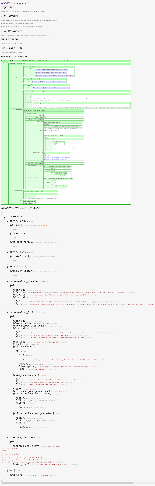

  _  __ ____  _____  _   _  _  _  ____  _____  _   _
 | |/ // __ \|_   _|| \ | || |/ // __ \|_   _|| \ | |
 | ' /| |  | | | |  |  \| || ' /| |  | | | |  |  \| |
 |  < | |  | | | |  | . ` ||  < | |  | | | |  | . ` |
 | . \| |__| |_| |_ | |\  || . \| |__| |_| |_ | |\  |
 |_|\_\\____/|_____||_| \_||_|\_\\____/|_____||_| \_|   
   

Koinkoin est un projet php/zend qui permet(tra) d'extraire du contenu textuel sur le web, pour le récupérer dans un fichier csv json, ou encore un array (etc..).

Les contenus sont extraits à l'aide de filtres XPATH ou REGEX.

Site internet   : http://dreamproject.fr/koinkoin/public

Github          : https://github.com/kkscrap/koinkoin

Mail            : koinkoin-php@dreamproject.fr

#################################

Exemple

#################################

- 20170315 ==> premiere maquette, qui scrape une URL_HTTPS pour obtenir un CONTENU_TEXTE_XPATH 

http://dreamproject.fr/koinkoin_20170315/public/index.php/scrap/maquette1

Try it Yourself »
